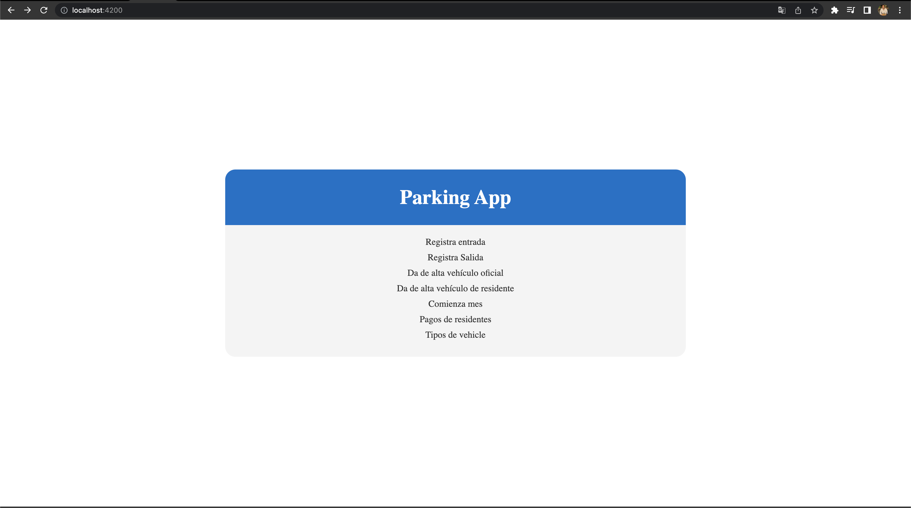
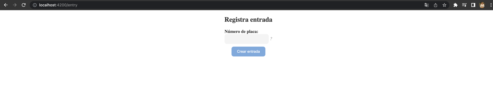
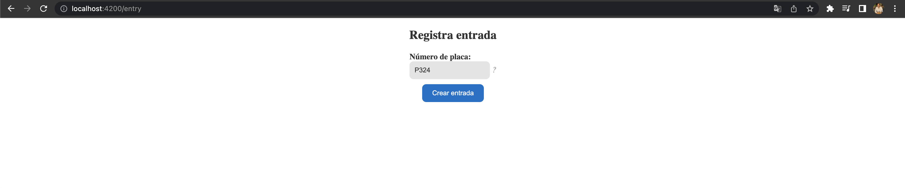
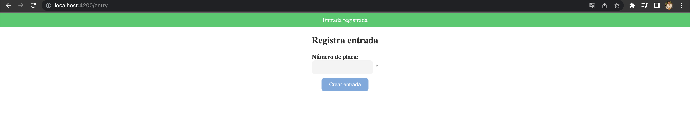
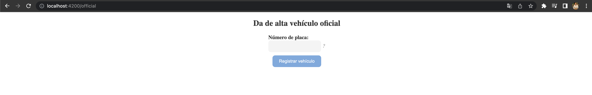
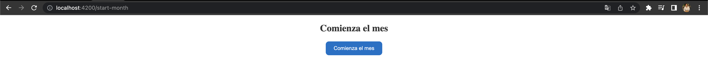
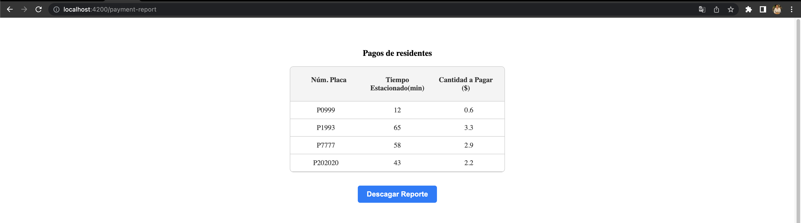
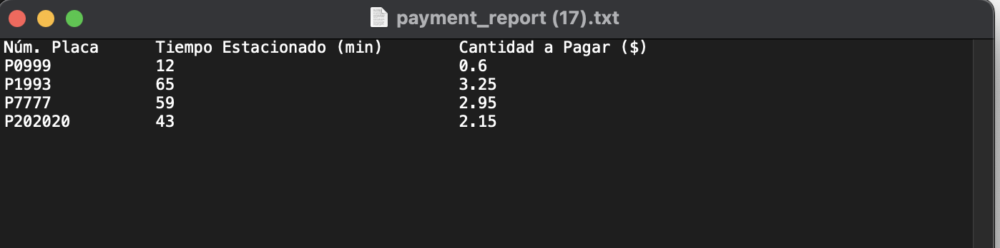
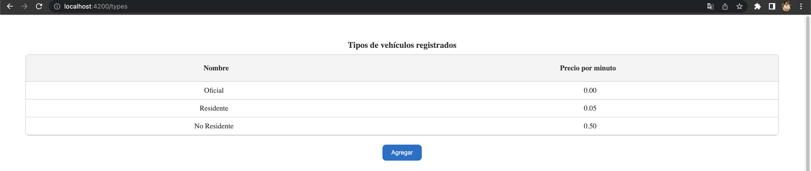

# Parking App Frontend - README

Este es el repositorio del proyecto de Angular "Parking App". A continuación, se detallan los pasos necesarios para configurar y ejecutar el proyecto, así como agregar capturas de pantalla.

## Requisitos previos

Asegúrate de tener los siguientes requisitos previos instalados en tu entorno de desarrollo:

- Node.js y npm (https://nodejs.org)
- Angular CLI (https://cli.angular.io)

## Configuración

Sigue los pasos a continuación para configurar el proyecto:

1. Clona este repositorio en tu máquina local o descárgalo como archivo ZIP.

2. Abre una terminal y navega hasta la carpeta del proyecto.

3. Ejecuta el siguiente comando para instalar las dependencias del proyecto:

   ```
   npm install
   ```

## Ejecución

Una vez que hayas completado la configuración, puedes ejecutar el proyecto de la siguiente manera:

```
ng serve
```

Esto iniciará el servidor de desarrollo de Angular y podrás acceder a la aplicación en tu navegador ingresando la URL `http://localhost:4200` (o la URL especificada por el servidor de desarrollo de Angular).


# ScreenShots

## Menu Principal 



## Registro de una entrada o una salida

El botón de registrar una entrada/salida está deshabilitado y se activa cuando se ingresa un placa

Desactivado:



Activado:



Cuando se ingresa correctamente una placa el usuario es notificado



## Dar de alta a un vehículo oficial  o residente 




# Comienza Mes

Aquí al precionar el botón el usuario es notificado de que el mes ha sido actualizado


# Pagos de residentes

Aquí la lista se despliega tanto en el frontend, como en un archivo txt que se genera al dar click al botón



# Este es el reporte en formato txt 



# Tipos de Vehiculo

Aquí se muestra los tipos de vehículos existentes




